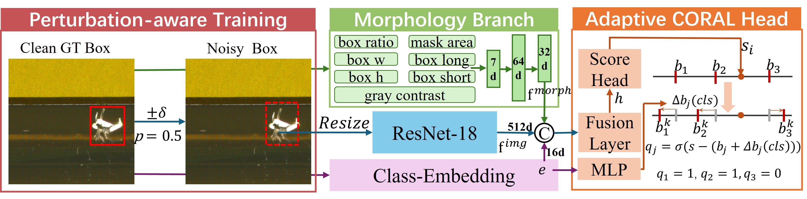
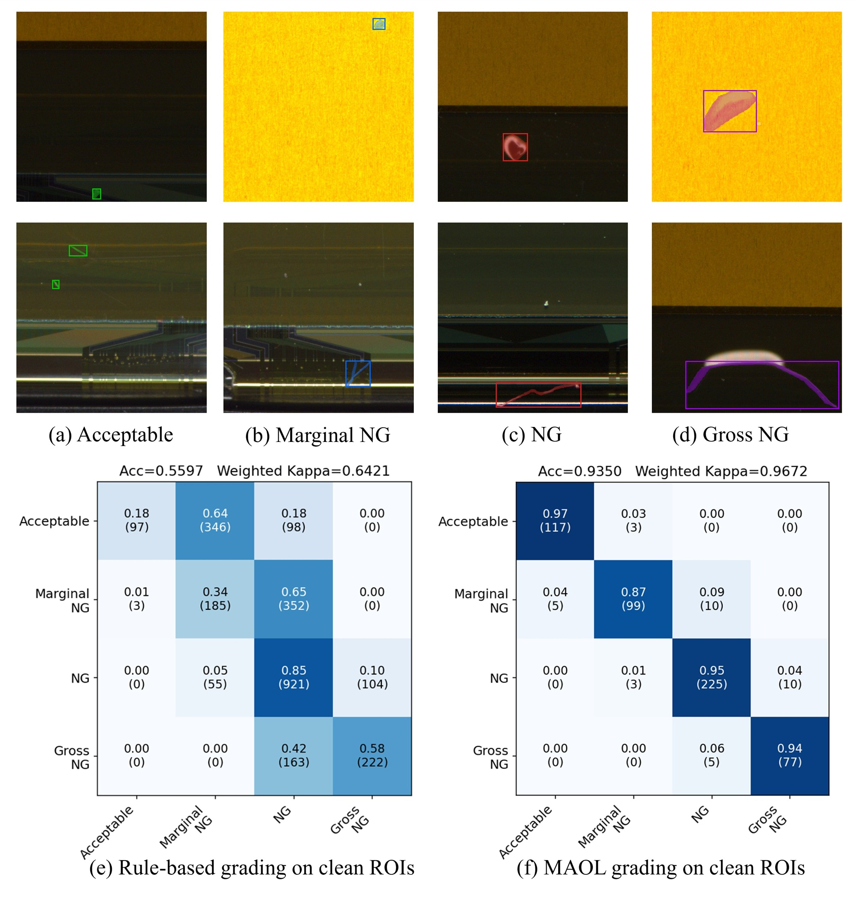

# MAOL

Official implementation of **MAOL: Morphology-Aware Ordinal Learning for Fine-Grained Industrial Defect Severity Grading**.

MAOL is a two-stage pipeline for industrial defect severity grading. A YOLOv8 segmentation model first localizes defect instances, and a severity grader then predicts ordered severity levels with morphology-aware ROI features, class-conditioned adaptive CORAL thresholds, and prediction-aware ROI perturbation.



## Highlights

- Instance segmentation front-end based on YOLOv8.
- ResNet-18 severity grader with CORAL ordinal regression.
- Learnable morphology branch for area, shape, aspect ratio, and gray-contrast cues.
- Class embedding and class-conditioned adaptive ordinal thresholds.
- Prediction-aware ROI perturbation for robustness to detector localization noise.
- Evaluation tools for clean-ROI and predicted-instance settings.

## Repository Layout

```text
MAOL_release/
  baseline/                  YOLO training, inference, and metric helpers
  configs/                   Dataset config and defect class names
  docs/assets/               Paper figures used by the README
  severity/
    datasets/                ROI datasets and predicted-instance datasets
    models/                  Compatibility import path for severity models
    scripts/                 Severity training and evaluation scripts
    splits/                  Example train/validation split files
    utils/                   Losses, metrics, matching, and grade schema
  train.sh                   End-to-end training entry point
  infer.sh                   End-to-end inference entry point
  eval.sh                    Evaluation entry point
```

## Installation

Create a Python 3.10 environment and install dependencies:

```bash
conda env create -f environment.yml
conda activate maol
```

or with pip:

```bash
python -m pip install -r requirements.txt
```

For CUDA-enabled PyTorch, install the build that matches your CUDA version from the official PyTorch instructions, then install the remaining packages with `requirements.txt`.

## Data And Checkpoints

Datasets and model checkpoints are not included in this repository. Prepare them locally with the following structure or pass equivalent paths through the command line:

```text
data/
  Track2/NG_1154/
    images/
      <image_stem>.bmp
    level_labels/
      <image_stem>.json
  test/Track2_TestData_Fine-Grained-Severity-Grading/
    <test_images>

checkpoints/
  yolov8x-seg.pt
  yolo_best.pt
  severity_E6_best.pth
```

Ground-truth severity JSON files are expected to contain entries with `class`, `points`, and `severity` fields. YOLO prediction files use the standard segmentation TXT format:

```text
class_id x1 y1 x2 y2 ... xn yn
```

Coordinates are normalized to `[0, 1]`.

## Training

Run the complete pipeline:

```bash
bash train.sh
```

Train only the MAOL severity grader:

```bash
python severity/scripts/train_severity_baseline_ce.py \
  --img_dir data/Track2/NG_1154/images \
  --label_dir data/Track2/NG_1154/level_labels \
  --split_file severity/splits/split.json \
  --head_type coral \
  --use_morphology true \
  --use_class_embedding true \
  --use_adaptive_thresholds true \
  --use_pred_aware_roi true \
  --epochs 350 \
  --batch_size 64 \
  --save_dir severity/results
```

## Inference

Run detection, severity grading, and submission conversion:

```bash
bash infer.sh
```

Or run severity grading on existing YOLO segmentation predictions:

```bash
python grade_severity.py \
  --method E6 \
  --labels_dir result/predict_test/labels \
  --img_dir data/test/Track2_TestData_Fine-Grained-Severity-Grading \
  --checkpoint checkpoints/severity_E6_best.pth \
  --output_dir result/grading_E6
```

Convert per-image grading JSON files to a submission-style JSON:

```bash
python convert_e8_to_submission.py \
  --input_dir result/grading_E6 \
  --output result/Track2_submission.json \
  --img_search data/test/Track2_TestData_Fine-Grained-Severity-Grading
```

## Evaluation

Run the provided evaluation pipeline:

```bash
bash eval.sh
```

For predicted-instance evaluation:

```bash
python severity/scripts/eval_predicted_instances.py \
  --split_file severity/splits/split.json \
  --img_dir data/Track2/NG_1154/images \
  --label_dir data/Track2/NG_1154/level_labels \
  --prediction_dir result/labels_val \
  --checkpoint_path checkpoints/severity_E6_best.pth \
  --output_dir severity/results_predicted/formal_E6 \
  --eval_mode formal
```



## Citation

If this repository helps your research, please cite:

```bibtex
@inproceedings{maol2026,
  title={MAOL: Morphology-Aware Ordinal Learning for Fine-Grained Industrial Defect Severity Grading},
  author={MAOL Authors},
  year={2026}
}
```

## License

This project is released under the MIT License. See [LICENSE](LICENSE) for details.
